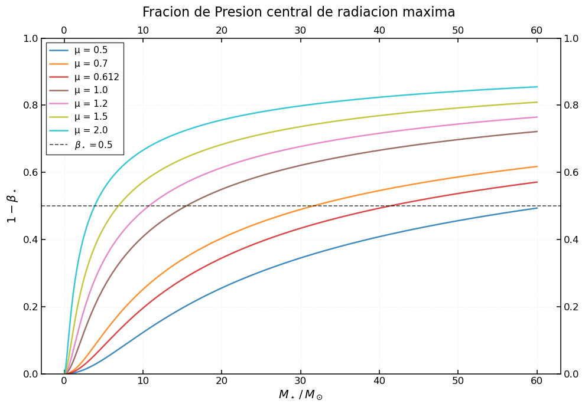

# Solar Structure Modeling — Parcial 2

Modelado de la estructura interna solar a partir del Modelo S de Christensen-Dalsgaard et al. (1996). El trabajo cubre dos actividades principales:

- **2A:** Cálculo de la distribución de masa encerrada $M(r)$ y la energía potencial gravitacional $\Omega$, a partir del perfil de densidad del Modelo S.
- **2B:** Estimación de la cota superior de la fracción de presión de radiación central $1-\beta^*$ para distintos valores del peso molecular medio $\mu$, siguiendo la proposición 7 del modelo estándar de Eddington.

El informe completo en LaTeX se encuentra en `main.tex` y compila a `build/main.pdf`.

## Estructura del proyecto

```
Solar_estructure_modeling/
├── main.ipynb          # Análisis completo (cargar datos, cálculos, gráficas)
├── main.tex            # Informe LaTeX (Parcial 2)
├── build/              # Salida de la compilación LaTeX (PDF y auxiliares)
├── images/             # Figuras exportadas por el notebook para el informe
├── data/
│   └── data.txt        # Datos del Modelo S (descargados de users-phys.au.dk)
├── utilities/
│   └── ploting.py      # Función plot_data usada para todas las gráficas
├── biblography.bib     # Referencias bibliográficas
└── .latexmkrc          # Configuración de latexmk (salida a build/, usa pdflatex)
```

## Resultados principales

**2A — Distribución de masa y energía potencial gravitacional**

| Magnitud | Valor |
|---|---|
| Energía potencial gravitacional $\|\Omega_\odot\|$ | $6.12 \times 10^{41}\ \mathrm{J}$ |
| Parámetro virial $q$ | $1.617$ |

El valor de $q$ es coherente con el esperado para un politropo de índice $n=3$ ($q \approx 1.5$); la desviación refleja que el perfil de densidad real del Sol no es exactamente politrópico.

**2B — Cota superior de la fracción de presión de radiación**

Para la composición solar ($\mu = 0.612$) el límite $\beta^* = 0.5$ se alcanza alrededor de $\sim 25\ M_\odot$. Por encima de $\approx 60\ M_\odot$ todas las configuraciones superan la cota independientemente de $\mu$, marcando el límite de Eddington.



## Uso

**Generar las figuras:** ejecutar todas las celdas de `main.ipynb`. Las imágenes se guardan automáticamente en `images/`.

**Compilar el informe:** desde la raíz del proyecto:
```bash
latexmk main.tex
```
El PDF resultante queda en `build/main.pdf`.

